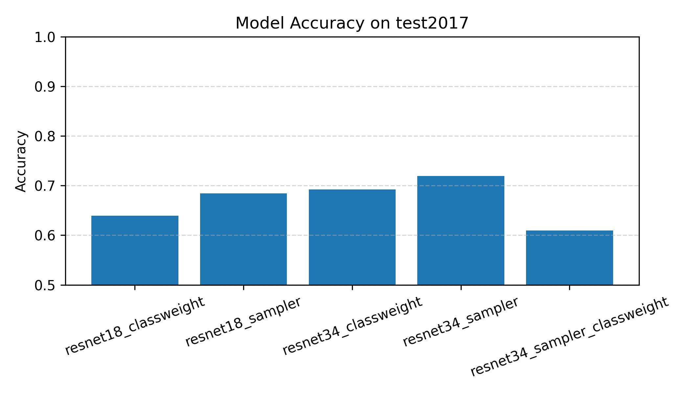

# cardd-image-classification-benchmark
Benchmarking multiple deep learning models on the CARDD dataset for automotive defect image classification with imbalance-handling strategies.

---

This repository benchmarks multiple deep learning models on the **CARDD (Car Damage Detection)** dataset for automotive defect image classification.  
The project evaluates **class imbalance handling**, **transfer learning strategies**, and **multiple model architectures**, providing a reproducible and well-structured benchmark pipeline.

---

## 📌 Project Overview

The goal of this project is to classify six types of vehicle exterior defects using COCO-format annotations from the CARDD dataset:

- dent  
- scratch  
- crack  
- glass shatter  
- lamp broken  
- tire flat  

This benchmark compares different training strategies such as:

- **ResNet18 / ResNet34 transfer learning**
- **Class Weighting**
- **WeightedRandomSampler**
- **Combination of both imbalance mitigation techniques**

A standardized test set (`test2017 + instances_test2017.json`) is used for **fair model comparison**.

---

## 📁 Repository Structure

```
cardd-image-classification-benchmark/
│
├── notebooks/
│   ├── 01_resnet18_class_weight.ipynb
│   ├── 02_resnet18_sampler.ipynb
│   ├── 03_resnet34_class_weight.ipynb
│   ├── 04_resnet34_sampler.ipynb
│   ├── 05_resnet34_sampler_class_weight.ipynb
│   └── 06_best_model_comparison.ipynb
│
├── models/                 # (Not included in the repo)
│   ├── resnet18_classweight.pth
│   ├── resnet18_sampler.pth
│   ├── resnet34_classweight.pth
│   ├── resnet34_sampler.pth
│   └── resnet34_sampler_classweight.pth
│
├── outputs/
│   ├── 01_resnet18_class_weight/
│   ├── 02_resnet18_sampler/
│   ├── 03_resnet34_class_weight/
│   ├── 04_resnet34_sampler/
│   ├── 05_resnet34_sampler_class_weight/
│   └── 06_best_model_comparison/
│
├── data/                    # (Not included in the repo)
│   └── CarDD_COCO/
│       ├── annotations/
│       ├── train2017/
│       ├── val2017/
│       └── test2017/
│
├── README.md
├── requirements.txt
└── .gitignore
```

---

## 📂 Dataset Setup

Due to licensing restrictions, the CARDD dataset is **not included** in this repository.

This project utilizes the CarDD (Car Damage Dataset) to conduct classification experiments using multiple deep learning models.

CarDD contains approximately 4,000 images of exterior vehicle damage, covering various defect types such as scratches, dents, cracks, discoloration, contamination, and more.
The dataset is provided in COCO format and is widely used for research on vehicle damage detection and recognition.

[Official CarDD Website](https://cardd-ustc.github.io/?utm_source=chatgpt.com)

To use this project:

1. Create a `data/` directory.
2. Place the dataset inside:

```
data/
└── CarDD_COCO/
    ├── annotations/
    │   ├── instances_train2017.json
    │   ├── instances_val2017.json
    │   └── instances_test2017.json
    ├── train2017/
    ├── val2017/
    └── test2017/
```

---

## 🚀 Features

### ✔ Transfer Learning Benchmark  
Evaluate performance differences between **ResNet18** and **ResNet34**.

### ✔ Imbalance Handling  
- `class_weight`: improves recall on minority classes  
- `WeightedRandomSampler`: improves balanced sampling  
- Combined strategy effects explored

### ✔ Unified Evaluation Pipeline  
All models are evaluated on the same test set enabling:

- Overall Accuracy  
- Per-class Precision / Recall / F1  
- Confusion Matrix  
- Visual Sample Comparison  

### ✔ Reproducibility  
`seed_everything()` ensures deterministic training for fair model comparison.

---

## 🧪 How to Run

### 1) Install dependencies

```bash
pip install -r requirements.txt
```

### 2) Prepare dataset

Place CARDD_COCO inside the `data/` folder (structure above).

### 3) Run training notebooks  
Each notebook inside `/notebooks` corresponds to a specific experiment.

### 4) Compare all trained models  

Open:

```
notebooks/06_best_model_comparison.ipynb
```

This notebook:

- Loads all `.pth` models
- Runs evaluation on test2017
- Generates accuracy / F1 comparison graphs
- Produces confusion matrices and sample predictions

---

## 📊 Experimental Results (Validation Performance)

We evaluated five combinations of backbones and imbalance mitigation strategies.  
The results show clear patterns in how each method affects major and minority classes.

### **Summary of Validation Results**

| Model Combination | Validation Accuracy | Notes |
|------------------|--------------------|-------|
| **1. ResNet18 + Class Weight** | 67.78% | Stable baseline, moderate minority improvement |
| **2. ResNet18 + Sampler** | ⭐ **72.10% (Best Validation Performance)** | Most balanced overall, strong generalization on val set |
| **3. ResNet34 + Class Weight** | 68.77% | Strong major-class recall, moderate minority gain |
| **4. ResNet34 + Sampler** | 71.85% | 2nd-best on validation but best generalization (test set winner) |
| **5. ResNet34 + Sampler + Class Weight** | 60.25% | Over-correction, unstable training |

### Key Observations

1. **Sampler consistently improves minority-class recall**, especially for crack and lamp broken.  
2. **Class Weight alone helps but is less stable** on deeper models like ResNet34.  
3. **Combining Sampler + Class Weight leads to over-correction**, resulting in the worst performance (60%).  
4. **ResNet18 + Sampler achieved the highest validation accuracy (72.1%)**, showing strong balance across classes.  
5. **ResNet34 + Sampler achieved the highest Test Accuracy (~71.9%)**, demonstrating superior generalization capability.

### 🏆 Final Selected Benchmark Model  
**ResNet34 + WeightedRandomSampler**  
- Strong validation performance (71.85%)  
- Best test set performance (71.93%)  
- Excellent balance of accuracy, stability, and generalization  



.jpg)


---

## 📌 Requirements

See `requirements.txt` for the Python environment.  
(Compatible with Python 3.9+ and PyTorch 2.x)

---

## ✨ Author
**Kwangho Lee (이광호)**  
Department of Mechanical Engineering, Sungkyunkwan University

- GitHub: [@mavro7910](https://github.com/mavro7910)  
- Email: kwangho97@g.skku.edu  

---

## 📜 License
MIT License  
Copyright © 2025 Kwangho Lee
